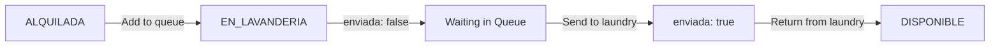

## Overview

The laundry management system tracks costumes that need to be cleaned. When customers return rented costumes, they must go through the laundry queue before becoming available for rent again. The system supports priority handling and FIFO (First In, First Out) processing.

## Understanding the Laundry Queue

The laundry queue (`ListaLavanderia`) is a waiting list of costumes that need cleaning. Each entry contains:

<ParamField path="id" type="number">
  Auto-generated unique identifier for this laundry queue entry.
</ParamField>

<ParamField path="prenda" type="object" required>
  The costume that needs cleaning (referenced by `referencia` - costume reference code).
</ParamField>

<ParamField path="prioridad" type="boolean">
  Priority flag. If `true`, this costume should be cleaned urgently. Defaults to `false`.
</ParamField>

<ParamField path="fecha_registro" type="timestamp">
  Auto-generated timestamp when the costume was added to the laundry queue.
</ParamField>

<ParamField path="enviada" type="boolean">
  Indicates if the costume has been sent to laundry. `false` = waiting in queue, `true` = already sent. Defaults to `false`.
</ParamField>

## Costume Flow Through Laundry

<Steps>
  <Step title="Customer Returns Costume">
    After rental, customer returns costume in used condition.
  </Step>
  
  <Step title="Add to Laundry Queue">
    Staff adds costume to laundry queue with optional priority flag. Costume state changes to `EN_LAVANDERIA`.
  </Step>
  
  <Step title="Queue Waiting">
    Costume sits in queue with `enviada: false` until ready to send to cleaners.
  </Step>
  
  <Step title="Send to Laundry">
    When ready, staff sends batch of costumes to laundry service. System marks them `enviada: true`.
  </Step>
  
  <Step title="Cleaning Process">
    External laundry service cleans the costumes (outside the system).
  </Step>
  
  <Step title="Return from Laundry">
    Clean costumes returned. Staff changes costume state back to `DISPONIBLE` for next rental.
  </Step>
</Steps>

## Adding Costumes to Laundry Queue

When a customer returns costumes, add them to the laundry queue:

<Tabs>
  <Tab title="Standard Priority">
    ### Add Regular Laundry Item
    
    Most returned costumes should be added with standard priority:
    
    **Endpoint:** `POST /lavanderia`
    
    ```bash cURL
    curl -X POST http://localhost:3000/lavanderia \
      -H "Content-Type: application/json" \
      -d '{
        "referencia": "PRIN-001"
      }'
    ```
    
    Or explicitly set `prioridad: false`:
    
    ```bash cURL
    curl -X POST http://localhost:3000/lavanderia \
      -H "Content-Type: application/json" \
      -d '{
        "referencia": "PRIN-001",
        "prioridad": false
      }'
    ```
    
    **System Actions:**
    - Creates laundry queue entry
    - Changes costume state from `ALQUILADA` → `EN_LAVANDERIA`
    - Sets `enviada: false` (waiting in queue)
    - Records current timestamp as `fecha_registro`
    - Sets `prioridad: false`
  </Tab>
  
  <Tab title="High Priority">
    ### Add Urgent Laundry Item
    
    Use priority flag for costumes needed urgently (e.g., pre-booked for tomorrow):
    
    **Endpoint:** `POST /lavanderia`
    
    ```bash cURL
    curl -X POST http://localhost:3000/lavanderia \
      -H "Content-Type: application/json" \
      -d '{
        "referencia": "SUP-042",
        "prioridad": true
      }'
    ```
    
    <Note>
      Priority costumes should be processed first when sending batches to laundry.
    </Note>
    
    **When to Use Priority:**
    - Costume has a rental reservation soon
    - Limited inventory of this costume type
    - Customer waiting for specific costume
    - Peak season with high demand
  </Tab>
</Tabs>

### Request Parameters

<ParamField path="referencia" type="string" required>
  Reference code of the costume to add to laundry queue. Costume must exist in the system.
</ParamField>

<ParamField path="prioridad" type="boolean">
  Optional priority flag. `true` = high priority, `false` = standard. Defaults to `false` if not provided.
</ParamField>

## Viewing Laundry Queue

Check which costumes are waiting to be sent to laundry:

**Endpoint:** `GET /lavanderia`

```bash cURL
curl -X GET http://localhost:3000/lavanderia
```

<Note>
  This endpoint returns only **pending** items where `enviada: false`. Already-sent items are filtered out.
</Note>

### Example Response

```json
[
  {
    "id": 15,
    "prenda": {
      "referencia": "SUP-042",
      "nombre": "Superman Suit",
      "talla": "Adult M",
      "tipo": "Superhero",
      "estado": "EN_LAVANDERIA",
      "precio_alquiler": 45.00
    },
    "prioridad": true,
    "fecha_registro": "2026-03-12T10:30:00.000Z",
    "enviada": false
  },
  {
    "id": 16,
    "prenda": {
      "referencia": "PRIN-001",
      "nombre": "Princess Elsa Dress",
      "talla": "Child 8-10",
      "tipo": "Princess",
      "estado": "EN_LAVANDERIA",
      "precio_alquiler": 35.00
    },
    "prioridad": false,
    "fecha_registro": "2026-03-12T11:15:00.000Z",
    "enviada": false
  },
  {
    "id": 17,
    "prenda": {
      "referencia": "WIZ-003",
      "nombre": "Wizard Robe",
      "talla": "Adult L",
      "tipo": "Fantasy",
      "estado": "EN_LAVANDERIA",
      "precio_alquiler": 40.00
    },
    "prioridad": false,
    "fecha_registro": "2026-03-12T14:20:00.000Z",
    "enviada": false
  }
]
```

## Sending Costumes to Laundry

When you're ready to send a batch of costumes to the laundry service:

**Endpoint:** `POST /lavanderia/enviar`

```bash cURL
curl -X POST http://localhost:3000/lavanderia/enviar \
  -H "Content-Type: application/json" \
  -d '{
    "cantidad": 5
  }'
```

<ParamField path="cantidad" type="number" required>
  Number of costumes to send to laundry. Must be a positive integer (minimum 1).
</ParamField>

### FIFO Processing with Priority

The system uses FIFO (First In, First Out) with priority handling:

<Steps>
  <Step title="Priority Items First">
    Costumes with `prioridad: true` are selected first, regardless of when they were added.
  </Step>
  
  <Step title="Oldest First Within Priority">
    Among priority items, oldest (earliest `fecha_registro`) are selected first.
  </Step>
  
  <Step title="Then Standard Items">
    After all priority items, standard items are selected oldest-first.
  </Step>
  
  <Step title="Mark as Sent">
    Selected items are marked `enviada: true` and removed from pending queue.
  </Step>
</Steps>

### Example Scenarios

<Tabs>
  <Tab title="Send 3 Items">
    **Queue State:**
    ```
    ID | Reference  | Priority | Added Time
    15 | SUP-042    | true     | 10:30 AM
    18 | BAT-007    | true     | 2:45 PM
    16 | PRIN-001   | false    | 11:15 AM
    17 | WIZ-003    | false    | 2:20 PM
    19 | PIR-012    | false    | 3:00 PM
    ```
    
    **Request:**
    ```bash
    POST /lavanderia/enviar {"cantidad": 3}
    ```
    
    **Items Sent (in order):**
    1. SUP-042 (priority, oldest)
    2. BAT-007 (priority, second)
    3. PRIN-001 (standard, oldest)
    
    **Remaining in Queue:**
    - WIZ-003 (standard)
    - PIR-012 (standard)
  </Tab>
  
  <Tab title="Send More Than Available">
    **Queue State:**
    ```
    ID | Reference  | Priority | Added Time
    20 | PRIN-001   | false    | 11:15 AM
    21 | WIZ-003    | false    | 2:20 PM
    ```
    
    **Request:**
    ```bash
    POST /lavanderia/enviar {"cantidad": 5}
    ```
    
    **Result:**
    - Only 2 items sent (all available)
    - System sends maximum available, not an error
    - Queue becomes empty
  </Tab>
  
  <Tab title="Send with All Priority">
    **Queue State:**
    ```
    ID | Reference  | Priority | Added Time
    22 | SUP-042    | true     | 10:30 AM
    23 | BAT-007    | true     | 11:00 AM
    24 | PRIN-001   | false    | 9:00 AM  <- oldest overall
    25 | WIZ-003    | false    | 9:30 AM
    ```
    
    **Request:**
    ```bash
    POST /lavanderia/enviar {"cantidad": 3}
    ```
    
    **Items Sent:**
    1. SUP-042 (priority)
    2. BAT-007 (priority)
    3. PRIN-001 (standard, oldest)
    
    <Note>
      Even though PRIN-001 was added earliest, priority items go first.
    </Note>
  </Tab>
</Tabs>

## Common Workflows

### Processing Customer Returns

<Steps>
  <Step title="Customer Returns Costumes">
    Receive costumes back from customer after rental.
  </Step>
  
  <Step title="Inspect for Damage">
    Check each costume for:
    - Stains or spills
    - Tears or damage
    - Missing accessories
    - Excessive wear
  </Step>
  
  <Step title="Determine Priority">
    Ask yourself:
    - Is this costume pre-booked for soon?
    - Is inventory low for this type?
    - Is there urgent demand?
    
    If yes → `prioridad: true`
    If no → `prioridad: false` (default)
  </Step>
  
  <Step title="Add to Laundry Queue">
    For each costume:
    ```bash
    POST /lavanderia
    {
      "referencia": "PRIN-001",
      "prioridad": false
    }
    ```
  </Step>
  
  <Step title="Verify State Changed">
    Check costume is now `EN_LAVANDERIA`:
    ```bash
    GET /prendas/PRIN-001
    ```
  </Step>
</Steps>

### Daily Laundry Batch

<Steps>
  <Step title="Check Queue Size">
    View pending laundry items:
    ```bash
    GET /lavanderia
    ```
    Count how many items are waiting.
  </Step>
  
  <Step title="Prepare Laundry Bags">
    Get physical bags/containers ready for transport.
  </Step>
  
  <Step title="Send Batch">
    Send appropriate number to laundry:
    ```bash
    POST /lavanderia/enviar
    {
      "cantidad": 10
    }
    ```
  </Step>
  
  <Step title="Collect Physical Items">
    Gather the costumes that were marked as sent (match references from response).
  </Step>
  
  <Step title="Transport to Laundry">
    Deliver costumes to laundry service.
  </Step>
  
  <Step title="Track Externally">
    Keep records of which costumes were sent and expected return date.
  </Step>
</Steps>

### Receiving Clean Costumes

<Steps>
  <Step title="Laundry Service Returns Costumes">
    Receive cleaned costumes from laundry service.
  </Step>
  
  <Step title="Inspect Quality">
    Verify costumes are:
    - Clean and fresh
    - Properly pressed/folded
    - All accessories included
    - No new damage
  </Step>
  
  <Step title="Update Costume State">
    For each returned costume, change state back to available:
    
    <Warning>
      The current API does not provide an endpoint to update costume state. You may need to:
      - Manually update the database directly
      - Use an admin interface if available
      - Work with developers to add a state update endpoint
    </Warning>
  </Step>
  
  <Step title="Return to Inventory">
    Place costumes back in rental inventory, ready for next customer.
  </Step>
</Steps>

## Priority Management Strategy

### When to Use High Priority

<CardGroup cols={2}>
  <Card title="Confirmed Reservations" icon="calendar-check">
    Costume has a rental scheduled within 1-2 days.
  </Card>
  
  <Card title="Low Inventory" icon="exclamation-triangle">
    Only one or two items of this type available, high demand.
  </Card>
  
  <Card title="Popular Items" icon="star">
    High-demand costumes during peak season.
  </Card>
  
  <Card title="Customer Waiting" icon="clock">
    Customer specifically waiting for this costume to be cleaned.
  </Card>
</CardGroup>

### When Standard Priority is Fine

<CardGroup cols={2}>
  <Card title="No Immediate Need" icon="calendar">
    No rentals scheduled for this costume soon.
  </Card>
  
  <Card title="Good Inventory" icon="boxes-stacked">
    Multiple similar costumes available as alternatives.
  </Card>
  
  <Card title="Off-Peak Season" icon="leaf">
    Lower rental demand during slow periods.
  </Card>
  
  <Card title="Routine Maintenance" icon="rotate">
    Regular cleaning cycle, no urgency.
  </Card>
</CardGroup>

## Best Practices

<CardGroup cols={2}>
  <Card title="Process Returns Immediately" icon="bolt">
    Add costumes to laundry queue as soon as customers return them. Don't let them pile up.
  </Card>
  
  <Card title="Regular Batch Processing" icon="calendar-day">
    Send laundry batches on a consistent schedule (daily, every other day, etc.).
  </Card>
  
  <Card title="Monitor Queue Length" icon="list">
    Check pending queue regularly. If it grows too large, increase batch frequency.
  </Card>
  
  <Card title="Prioritize Wisely" icon="brain">
    Only use priority for truly urgent items. Too many priorities defeats the purpose.
  </Card>
  
  <Card title="Track External Process" icon="clipboard">
    Maintain external records of laundry batches sent and expected return dates.
  </Card>
  
  <Card title="Inspect Before Queue" icon="magnifying-glass">
    Check for damage before adding to laundry. Set aside damaged items for repair.
  </Card>
</CardGroup>

## Understanding the Data Model

### Laundry Queue Entry States

**`enviada: false`** (Pending)
- Costume is waiting in queue
- Has not been sent to laundry yet
- Appears in `GET /lavanderia` results
- Can be selected by `POST /lavanderia/enviar`

**`enviada: true`** (Sent)
- Costume has been sent to laundry service
- No longer appears in pending queue
- Costume state is still `EN_LAVANDERIA`
- Physical costume is with laundry service

### Costume State Through Laundry



## Troubleshooting

<AccordionGroup>
  <Accordion title="Costume not found error">
    When adding to laundry queue:
    
    - Verify costume reference code is correct
    - Check spelling and capitalization
    - Ensure costume exists: `GET /prendas/{referencia}`
    - Costume might have been deleted from system
  </Accordion>
  
  <Accordion title="Empty laundry queue">
    If `GET /lavanderia` returns empty array:
    
    - All costumes have been sent (`enviada: true`)
    - No costumes currently in laundry queue
    - This is normal if you've processed all pending items
    - Wait for customer returns to add more items
  </Accordion>
  
  <Accordion title="Can't send more than available">
    If requesting `cantidad: 10` but only 3 in queue:
    
    - System will send all available (3 in this case)
    - This is not an error, just sends maximum available
    - Check queue size first with `GET /lavanderia`
  </Accordion>
  
  <Accordion title="Costume stuck in EN_LAVANDERIA">
    If costume remains in laundry state after cleaning:
    
    - System requires manual state update after return from laundry
    - No automatic endpoint to change state back to DISPONIBLE
    - Contact system administrator or use admin interface
    - May require direct database update
  </Accordion>
  
  <Accordion title="Priority not working as expected">
    If priority items aren't sent first:
    
    - Verify `prioridad: true` was set when adding to queue
    - Check `GET /lavanderia` response to confirm priority flag
    - Priority only matters within the FIFO send process
    - Already-sent items (`enviada: true`) won't appear in queue
  </Accordion>
</AccordionGroup>

## Integration with Other Modules

### Relationship to Rentals

- Costumes must be `ALQUILADA` before adding to laundry (returned from rental)
- After adding to laundry, costume cannot be rented until cleaned and state changed to `DISPONIBLE`
- Rental history is preserved even while costume is in laundry

### Relationship to Costumes

- Laundry queue entries reference costumes by `referencia`
- Adding to queue automatically changes costume `estado` to `EN_LAVANDERIA`
- Queue tracks costume cleaning workflow while costume entity tracks overall state
- One costume can only be in queue once at a time

## Next Steps

<CardGroup cols={3}>
  <Card title="Costume Management" icon="shirt" href="/guides/costumes">
    Learn about costume states and inventory management
  </Card>
  
  <Card title="Rental Services" icon="handshake" href="/guides/rentals">
    Understand how rentals lead to laundry needs
  </Card>
  
  <Card title="API Reference" icon="code" href="/api/laundry">
    View complete API documentation for laundry endpoints
  </Card>
</CardGroup>